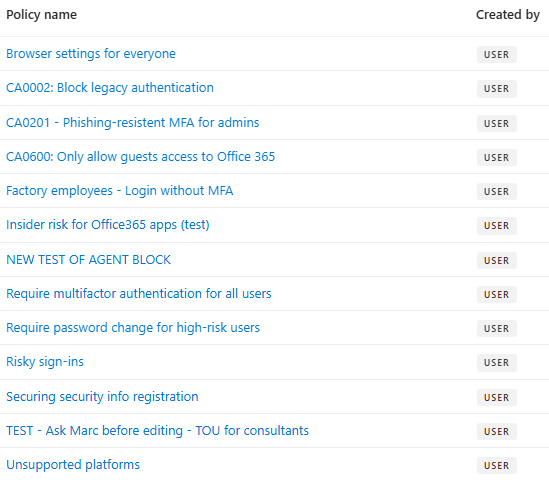

+++
title = "It's 10 p.m. - Do you know what your Conditional Access policies are doing?"
description = 'On the importance of naming Conditional Access policies in a consistant and descriptive way.'
summary = "If policy display names don't capture intent, it's easy to lose track of what your Conditional Access policies do. I wrote a PowerShell script that analyzes each policy and suggests clear, consistent names based on policy content - helping teams keep names aligned with configuration over time."
slug = 'automating-ca-policy-names'
date = 2026-01-13
tags = ['Conditional-Access','Automation','PowerShell']
[cover]
  image = 'pexels-mikhail-nilov-6963062.jpg'
  alt = 'people-night-smartphone-dark-693062'
  caption = 'Photo by Mikhail Nilov'
+++

**TL;DR:** If policy display names don't capture intent, it's easy to lose track of what your Conditional Access policies do. I wrote a PowerShell script that analyzes each policy and suggests clear, consistent names based on policy content - helping teams keep names aligned with configuration over time.

## Why naming matters

Conditional Access (CA) policies are essential for securing access across your tenant, but understanding what each policy does can be surprisingly difficult. I frequently see tenants where administrators don't know what many policies actually enforce - which creates both security gaps and poor user experiences.

The root causes are common:

* Policies accumulate over time, making an overview hard to maintain.
* Multiple administrators use different naming styles.
* Policies often carry obscure names created by former employees or external consultants.

Because CA policies lack a description field, the only practical way to document intent in the portal is to use a meaningful display name.


## Common naming approaches

### Microsoft-managed and template names

Microsoft-managed policies and template-based policies often use sentence-like names (for example, "Block legacy authentication"). These are readable but can become inconsistent when targeting specific apps, locations, or personas.

### Microsoft Learn suggested standard

Microsoft Learn suggests a structured format:

`<SN> - <Cloud app>: <Response> For <Principal> When <Conditions>`

Examples:

* `CA01 - Dynamics CRM: Require MFA for Marketing when on external networks`
* `CA02 - Office 365: Require Terms of Use for Guests when using browser`
* `CA03 - All apps: Block legacy authentication`

The serial numbers make it easier to identify specific policies during troubleshooting, and the structure helps readability.

### Zero Trust / Persona-based naming

The Conditional Access guidance for Zero Trust uses persona-based naming with serial prefixes and compact tokens. Personas group accounts of similar type (Internals, Admins, Guests, AzureServiceAccounts, etc.) so policies can target specific user types.

Examples:

* `CA100-Admins-BaseProtection-AllApps-AnyPlatform-CompliantandMFA`
* `CA206-Internals-DataandAppProtection-AllApps-iOSorAndroid-ClientAppORAPP`
* `CA403-Guests-IdentityProtection-AllApps-AnyPlatform-BlockLegacyAuth`

Projects like Joey Verlinden's [Conditional Access Baseline](https://github.com/j0eyv/ConditionalAccessBaseline) have kept this approach up to date.

## A different approach: generate descriptive names

A naming standard helps, but names can drift as policies change - or administrators might not follow the standard. To address this, I created `Get-ConditionalAccessPolicyNameSuggestion.ps1` which can be found in my repository at [https://github.com/kovergard/ConditionalAccess/tree/main/Naming](https://github.com/kovergard/ConditionalAccess/tree/main/Naming)

### What the script does

* Parses each Conditional Access policy.
* Breaks policy configuration into components (persona, target, network, conditions, response).
* Combines components using a configurable pattern to produce suggested display names.

### Pattern components

| Component        | Description                                          | Default     |
| ---------------- | ---------------------------------------------------- | ----------- |
| {SerialNumber}   | Unique ID `CA{PersonaSerialNumber}{Counter}`         |             |
| {Persona}        | Persona the policy applies to                        | Global      |
| {TargetResource} | Application or user action                           | All apps    |
| {Network}        | Network conditions                                   | Any network |
| {Condition}      | Any additional conditions                            | Always      |
| {Response}       | Either `Block` or a list of requirements (MFA, etc.) | (none)      |

More details in the repo [README](https://github.com/kovergard/ConditionalAccess/tree/main/Naming#name-pattern-components)

## Examples

First, connect to Graph (read-only to inspect):

```powershell
Connect-MgGraph -Scopes Policy.Read.All,Application.Read.All,Group.Read.All
```

For the following examples, a set of sample policies are used.



### Default suggestions

Run without parameters (uses default pattern):

```powershell
.\Get-ConditionalAccessPolicyNameSuggestion.ps1
```



* Names consistently show key configuration details.
* A serial prefix enables sorting by persona.
* Existing serial numbers are preserved where appropriate.

### Emulate Microsoft Learn style

Set a pattern similar to Learn guidance:

```powershell
$Pattern = '{SerialNumber} - {TargetResource}: {Response} For {Persona} On {Network} When {Condition}'
.\Get-ConditionalAccessPolicyNameSuggestion.ps1 -NamePattern $Pattern
```



### Make it yours

Want compact names or different delimiters?

```powershell
$Pattern = '{SerialNumber}.{TargetResource}.{Network}.{Condition}.{Response}'
.\Get-ConditionalAccessPolicyNameSuggestion.ps1 -NamePattern $Pattern -Condense -KeepSerialNumbers
```


## Moving beyond suggestions - careful updates

The script suggests names; it does not change them by default. If you want to apply suggestions, you must connect with write permissions:

```powershell
Connect-MgGraph -Scopes Policy.ReadWrite.ConditionalAccess,Application.Read.All,Group.Read.All
```

Compare current names with suggestions:

```powershell
$CaNamesToUpdate = .\Get-ConditionalAccessPolicyNameSuggestion.ps1 |
    Where-Object {$_.Name -ne $_.SuggestedName}
$CaNamesToUpdate | Format-List
```

To apply suggested names:

```powershell
$CaNamesToUpdate | ForEach-Object {
    $DisplayName = $_.SuggestedName
    Invoke-MgGraphRequest -Method PATCH `
        -Uri "https://graph.microsoft.com/v1.0/identity/conditionalAccess/policies/$($_.id)" `
        -Body (@{ displayName = $DisplayName } | ConvertTo-Json)
}
```

> ⚠️ Important: This is not a security control - it's a naming and documentation aid. Always review suggested names and update any inclusion/exclusion groups or references that rely on policy names.

## Automation and next steps

You can automate the script to run periodically and generate a report of name drift. I recommend keeping it supervised until you're comfortable with the pattern and script behavior.

## Conclusion

Clear, consistent policy names make troubleshooting and governance far easier. This script helps you try naming standards across your actual policies so you can pick the format that best fits your organization.

Feedback and suggestions are welcome - open an issue in the repo or contact me via GitHub/LinkedIn/email.
